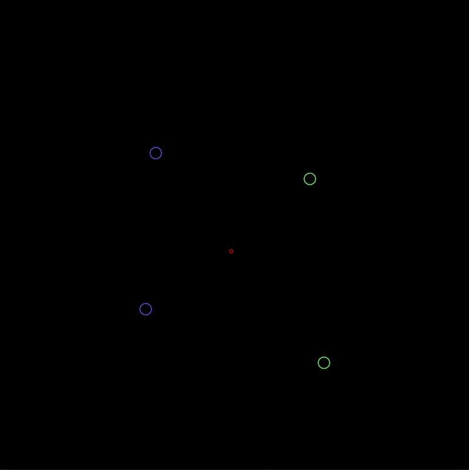

# bot-combat-sim

This is a framework for pitting AIs against each other in squad combat.

AIs are given knowledge of their bot's position, their opponents' / teammates' position, and the change in time since last update


### Example


### Todo
Give AIs visibility to projectiles so they can dodge

Limit firing rate of bots, and expose remaining time to each AI

Add ability for AIs to choose starting stats (speed / firing rate / damage) within limits

Add special projectile abilities (damage over time, heal allies, slow target, etc)

Consider opening issues for these instead of having a todo list

### How to run
Install [LOVE](https://love2d.org/) and call it from the root directory

### Development / TDD Setup (Linux)
Install lenv (https://github.com/mah0x211/lenv)

Setting up dependencies and TDD:
```
lenv fetch
lenv install-lj 2.0.5
lenv use-lj 2.0.5
sudo apt install luarocks
sudo luarocks install mach
sudo luarocks install busted
```

Running TDD:
`busted .`
